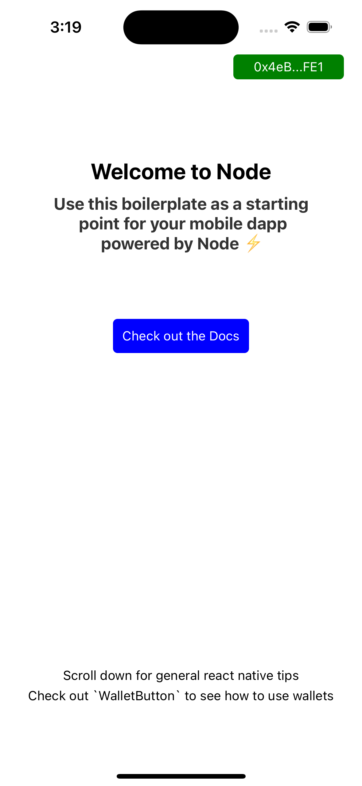

# Node Finance Boilerplate

This is a boilerplate to get up and running quickly with the Node Finance React Native SDK.

This boilerplate is the first of many, and will be the most bare-bones of the bunch. If you are a developer who is particular about your repository setup or the technologies you use in your application, then this is the right boilerplate for you. This boilerplate essentially covers all dependency setup for the Node SDK suite

[Find Documentation for Node SDKs Here](https://docs.nodefinance.org)



## Build

### Using yarn

```
yarn install
```

### Using npm

```
npm install
```

### iOS

Install pods via

```
npx pod-install
```

## Run

### iOS

Ensure you have installed pods and have configured your emulator with xCode

Then, run:

```
yarn ios
```

### Android

Ensure you have configured your android emulator or device correctly.

Then, run:

```
yarn android
```
